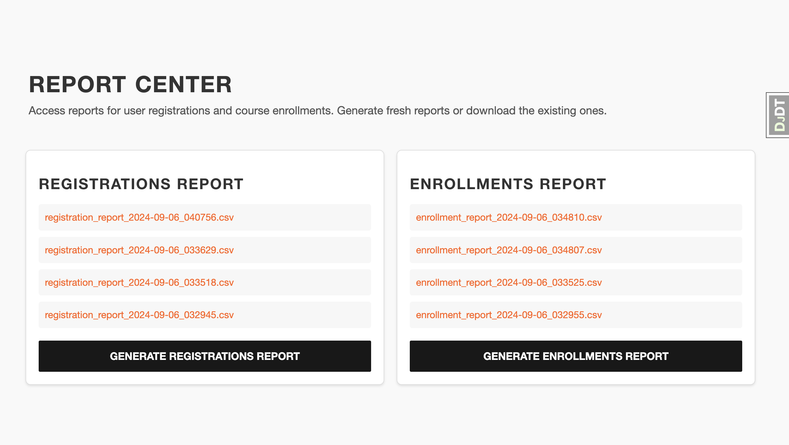
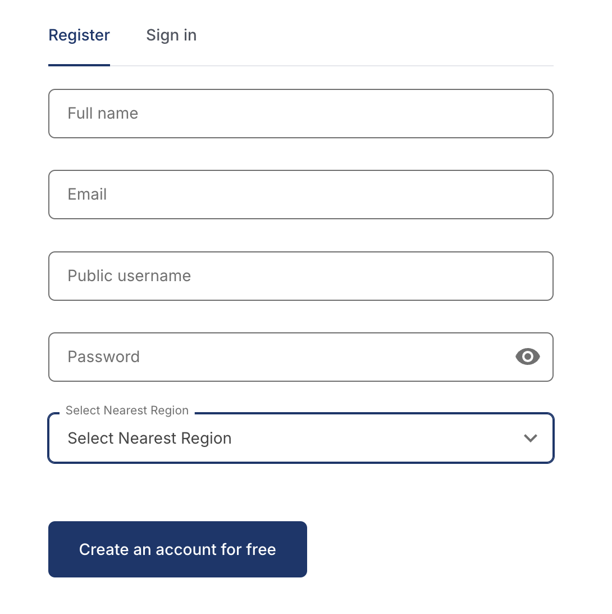
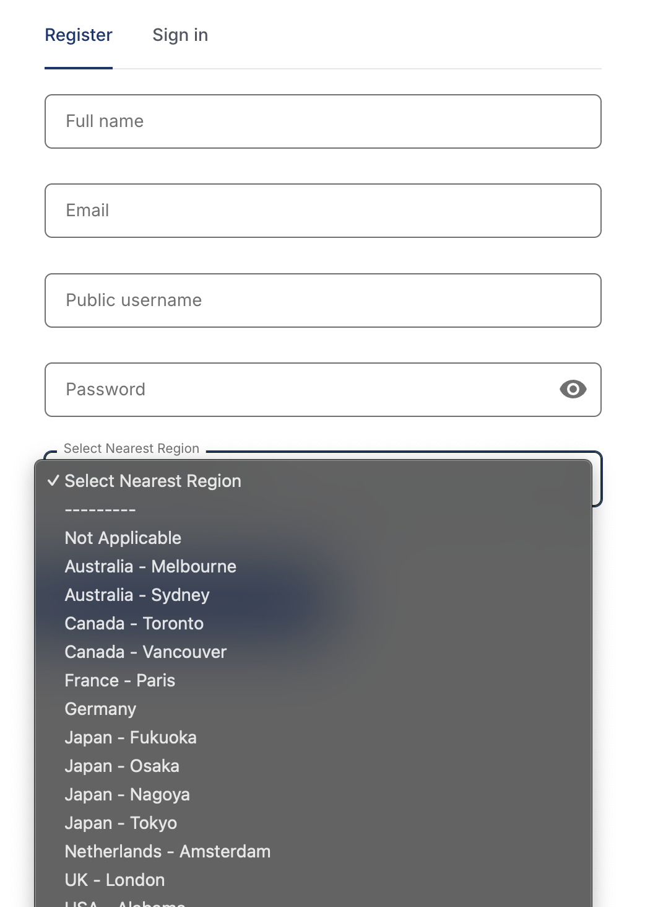
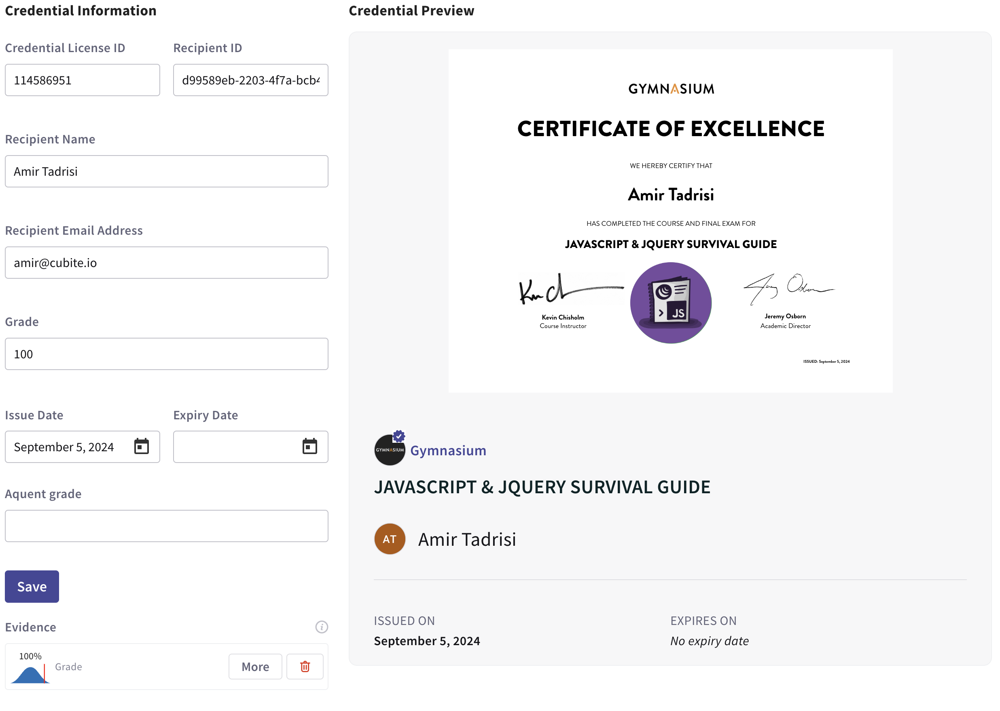

# Gymnasium Open edX Customizations

This project is a plugin for the Tutor LMS platform that allows for customization of the Gymnasium Open edX instance.

## Reporting Application

in [openedx-dockerfile-post-python-requirements](tutorgym_customizations/patches/openedx-dockerfile-post-python-requirements#L3)

```dockerfile
RUN pip install -e git+https://github.com/gymnasium/gym_reporting@main#egg=gymnasium-reporting
```

This line installs the reporting application, To access the reporting app,

1. Login as an admin user
1. Navigate to the [http://local.edly.io:8000/reporting/download/](http://local.edly.io:8000/reporting/download/)

You should somthing similar to the following in the browser:



## Custom Registration Form

in [openedx-dockerfile-post-python-requirements](tutorgym_customizations/patches/openedx-dockerfile-post-python-requirements#L2)

```dockerfile
RUN pip install -e git+https://github.com/gymnasium/custom_registration_form.git@release/redwood#egg=custom_reg_form
```

This line installs the custom registration form, To extend the registeration form and add market field to it.

### How to setup

Go to the [/admin/site_configuration/siteconfiguration/](http://local.edly.io:8000/admin/site_configuration/siteconfiguration/) and select `local.edly.io` and add the following to the site values:

```json
{
    "MFE_CONFIG": {
        "ENABLE_DYNAMIC_REGISTRATION_FIELDS": "true"
    },
    "extended_profile_fields": [
        "market"
    ]
}
```

Repeat the same steps for the `local.edly.io:8000`

Also check

- `ENABLE_DYNAMIC_REGISTRATION_FIELDS` in [common-env-features](tutorgym_customizations/patches/common-env-features) is set to `true`.
- `custom_reg_form` is in the `ADDL_INSTALLED_APPS` list in [lms-env](tutorgym_customizations/patches/lms-env)
- `REGISTRATION_EXTENSION_FORM` is set to `custom_reg_form.forms.ExtraInfoForm` in [lms-env](tutorgym_customizations/patches/lms-env)
- `REGISTRATION_FIELD_ORDER` has the `market` field in the list in [lms-env](tutorgym_customizations/patches/lms-env)
- `REGISTRATION_EXTRA_FIELDS['market']` is set to `required` in [openedx-common-settings](tutorgym_customizations/patches/openedx-common-settings)




## Gymnasium Patches

in [openedx-dockerfile-post-python-requirements](tutorgym_customizations/patches/openedx-dockerfile-post-python-requirements#L1)

```dockerfile
RUN pip install -e git+https://github.com/gymnasium/gym-overrides.git@release/redwood#egg=gym_overrides
```

We are injecting patches to:

- Track custom registration form in Segment
- Make honor and audit passing grades eligible for certificates
- Make audit mode eligible for certificates
- Replace Open edX default certificate awarding with Accredible

In the following section we will go over necessary configuration to make the above patches work.

### Segment Configuration

In order for the Segment configuration to work, we need to make sure that the `LMS_SEGMENT_KEY` is set in [openedx-lms-common-settings](tutorgym_customizations/patches/openedx-lms-common-settings) and `CMS_SEGMENT_KEY` is set in [openedx-cms-common-settings](tutorgym_customizations/patches/openedx-cms-common-settings).
Take a note of `EVENT_TRACKING_SEGMENTIO_EMIT_WHITELIST` values in the [lms-env](tutorgym_customizations/patches/lms-env) to check which events are being tracked in Segment.

We customized registration tracking to track the market field in the custom registration form. After successful registration, the market field is sent to Segment like the following:

```
analytics.identify('6', {
    'email': 'amirtds+test7687@gmail.com',
    'username': 'amirtadrisi',
    'name': 'Amir Tadrisi',
    'age': -1,
    'yearOfBirth': 2024,
    'education': null,
    'address': '',
    'gender': null,
    'country': '',
    'is_marketable': false,
    'extrainfo': {
        'market': '36'
    }
})
```

### Accredible Configuration

In order for the Accredible configuration to work, we need to make sure that the `ACCREDIBLE_API_KEY` is set in [lms-env](tutorgym_customizations/patches/lms-env).
This integration replaces the default certificate generation with Accredible. The workflow is the following:

1. By achieving a passing grade (all course modes) we send a `generate_certificate` signal
1. The task makes call to the Accredible API to generate the certificate with the grade, course and the user data.
1. a new `GeneratedCertificate` object is created using the API response data.



## How to Install this plugin

```bash
pip install -e tutor-contrib-gym-customizations
tutor plugins enable gym-customizations
tutor config save && tutor images build openedx|openedx-dev && tutor dev|local launch
```

**Note:** This plugin requires a `.env` file in your tutor root populated with (at least) the following values:
```
ACCREDIBLE_API_KEY=example-accredible-api-key
SEGMENT_API_KEY=example-segment-api-key
```
